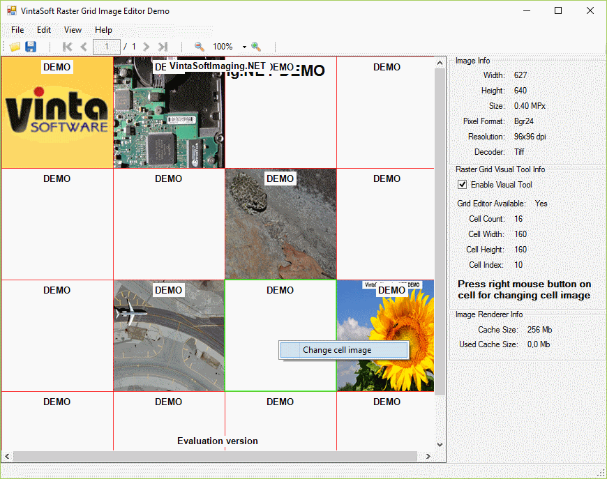

# VintaSoft WinForms Raster Grid Image Editor Demo

This C# project uses <a href="https://www.vintasoft.com/vsimaging-dotnet-index.html">VintaSoft Imaging .NET SDK</a> and demonstrates how to create and edit image of unlimited size using raster grid:
* Create new TIFF image of unlimited size.
* Open existing TIFF image of unlimited size.
* Edit TIFF image of unlimited size, image must consist from strips or tiles.
* Save changes in source TIFF file or to a new TIFF file.
* Undo changes if changes still not saved to a TIFF file.


## Screenshot



## Usage
1. Get the 30 day free evaluation license for <a href="https://www.vintasoft.com/vsimaging-dotnet-index.html" target="_blank">VintaSoft Imaging .NET SDK</a> as described here: <a href="https://www.vintasoft.com/docs/vsimaging-dotnet/Licensing-Evaluation.html" target="_blank">https://www.vintasoft.com/docs/vsimaging-dotnet/Licensing-Evaluation.html</a>

2. Update the evaluation license in "CSharp\MainForm.cs" file:
   ```
   Vintasoft.Imaging.ImagingGlobalSettings.Register("REG_USER", "REG_EMAIL", "EXPIRATION_DATE", "REG_CODE");
   ```

3. Build the project ("RasterGridImageEditorDemo.Net7.csproj" file) in Visual Studio or using .NET CLI:
   ```
   dotnet build RasterGridImageEditorDemo.Net7.csproj
   ```

4. Run compiled application and try to create and edit image of unlimited size using raster grid.


## Documentation
VintaSoft Imaging .NET SDK on-line User Guide and API Reference for .NET developer is available here: https://www.vintasoft.com/docs/vsimaging-dotnet/


## Support
Please visit our <a href="https://myaccount.vintasoft.com/">online support center</a> if you have any question or problem.
